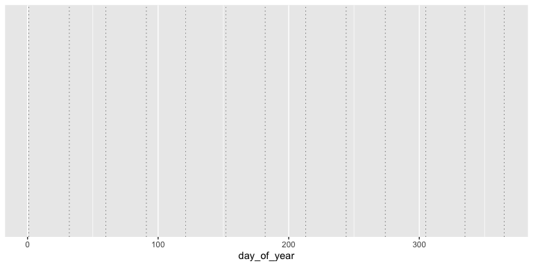
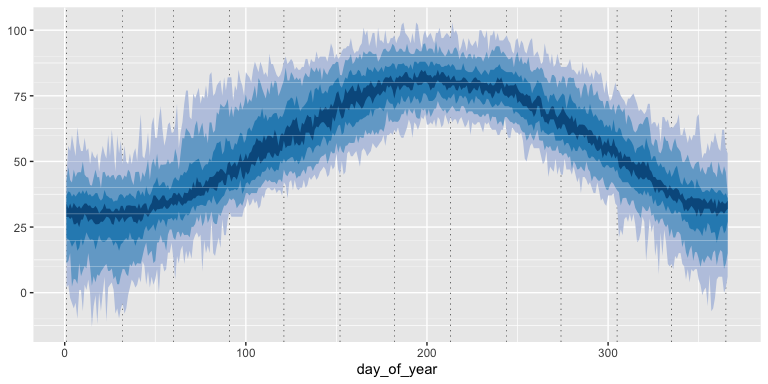
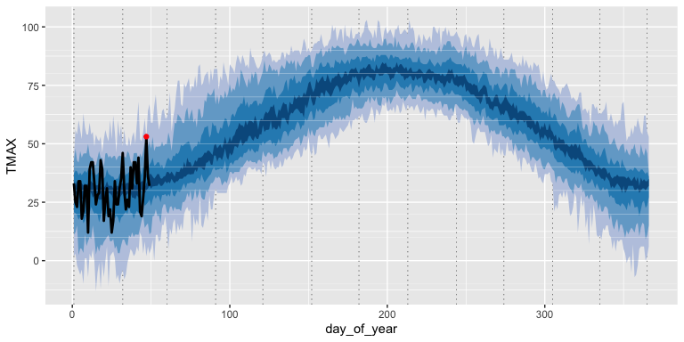
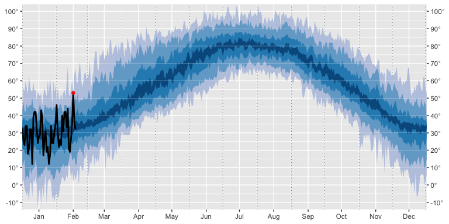
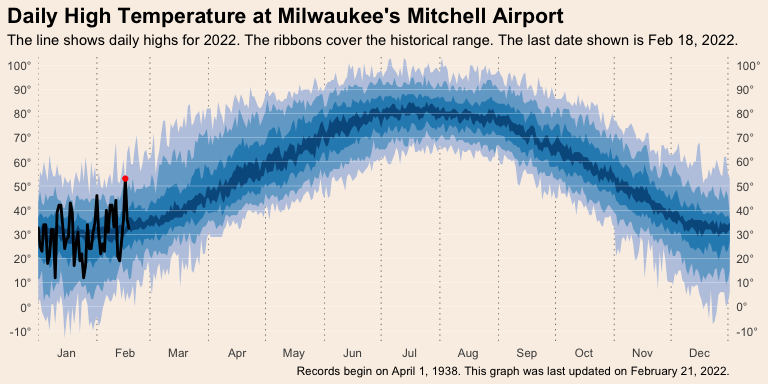
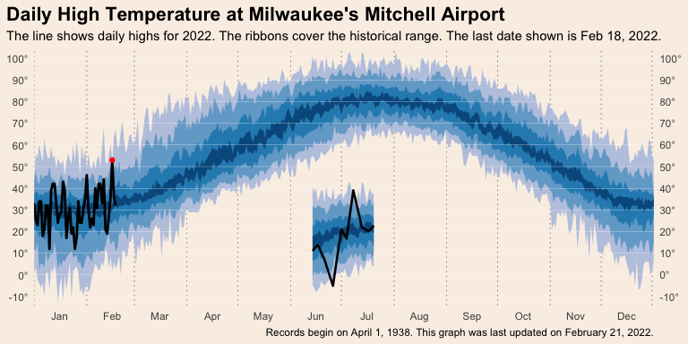
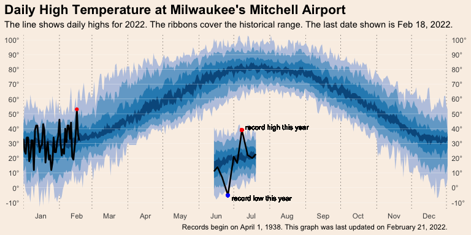

Building this graph with ggplot2
================
John Johnson
2/21/2022


Step 1. Retrieve the data.

``` r
library(ggplot2)
library(readr)
library(tidyr)
library(dplyr)
```

    ## 
    ## Attaching package: 'dplyr'

    ## The following objects are masked from 'package:stats':
    ## 
    ##     filter, lag

    ## The following objects are masked from 'package:base':
    ## 
    ##     intersect, setdiff, setequal, union

``` r
library(lubridate)
```

    ## 
    ## Attaching package: 'lubridate'

    ## The following objects are masked from 'package:base':
    ## 
    ##     date, intersect, setdiff, union

``` r
library(stringr)
ghcn <- read_csv(here::here("data/GHCN_USW00014839.csv"))
```

    ## Rows: 30640 Columns: 10

    ## ── Column specification ────────────────────────────────────────────────────────
    ## Delimiter: ","
    ## chr  (2): month, day
    ## dbl  (7): year, day_of_year, PRCP, SNOW, SNWD, TMAX, TMIN
    ## date (1): date

    ## 
    ## ℹ Use `spec()` to retrieve the full column specification for this data.
    ## ℹ Specify the column types or set `show_col_types = FALSE` to quiet this message.

``` r
head(ghcn)
```

    ## # A tibble: 6 × 10
    ##    year month day   date       day_of_year   PRCP  SNOW  SNWD  TMAX  TMIN
    ##   <dbl> <chr> <chr> <date>           <dbl>  <dbl> <dbl> <dbl> <dbl> <dbl>
    ## 1  1949 01    01    1949-01-01           1 0          0     0  28.9  14  
    ## 2  1949 01    02    1949-01-02           2 0          0     0  35.1  18.0
    ## 3  1949 01    03    1949-01-03           3 0.0197     0     0  37.0  33.1
    ## 4  1949 01    04    1949-01-04           4 0.272      0     0  41    36.0
    ## 5  1949 01    05    1949-01-05           5 0          0     0  39.0  17.1
    ## 6  1949 01    06    1949-01-06           6 0          0     0  39.9  17.1

Step 2. Identify latest year and day.

``` r
year.to.plot <- max(ghcn$year)
last.date <- max(ghcn$date)

this.year <- ghcn %>%
  filter(year == year.to.plot)
```

Step3. Calculate summary values for previous years.

``` r
daily.summary.stats <- ghcn %>%
  # remove this year
  filter(year != year.to.plot) %>%
  select(day_of_year, PRCP, TMAX, TMIN) %>%
  pivot_longer(cols = -day_of_year) %>%
  group_by(day_of_year, name) %>%
  summarise(max = max(value, na.rm = T),
            min = min(value, na.rm = T),
            x5 = quantile(value, 0.05, na.rm = T),
            x20 = quantile(value, 0.2, na.rm = T),
            x40 = quantile(value, 0.4, na.rm = T),
            x60 = quantile(value, 0.6, na.rm = T),
            x80 = quantile(value, 0.8, na.rm = T),
            x95 = quantile(value, 0.95, na.rm = T)) %>%
  ungroup()
```

    ## `summarise()` has grouped output by 'day_of_year'. You can override using the `.groups` argument.

``` r
head(daily.summary.stats)
```

    ## # A tibble: 6 × 10
    ##   day_of_year name     max    min    x5   x20   x40     x60     x80    x95
    ##         <dbl> <chr>  <dbl>  <dbl> <dbl> <dbl> <dbl>   <dbl>   <dbl>  <dbl>
    ## 1           1 PRCP   1.11    0     0     0      0    0       0.0394  0.496
    ## 2           1 TMAX  45.0     1.94 11.1  20.7   28.8 34.0    37.0    42.9  
    ## 3           1 TMIN  37.0   -11.0  -4.86  5.54  12.9 19.9    27.0    33.0  
    ## 4           2 PRCP   0.941   0     0     0      0    0.0118  0.0709  0.325
    ## 5           2 TMAX  55.9     3.02 12.1  20.4   28.9 32      38.6    47.8  
    ## 6           2 TMIN  39.9   -11.0  -2.92  4.35  13.6 20.2    27.0    34.0

Step 4. Identify the day of year on which each month begins

``` r
# month breaks
month.breaks <- ghcn %>%
  filter(year == 2019) %>%
  group_by(month) %>%
  slice_min(order_by = day_of_year, n = 1) %>%
  ungroup() %>%
  select(month, day_of_year) %>%
  mutate(month_name = month.abb)
head(month.breaks)
```

    ## # A tibble: 6 × 3
    ##   month day_of_year month_name
    ##   <chr>       <dbl> <chr>     
    ## 1 01              1 Jan       
    ## 2 02             32 Feb       
    ## 3 03             60 Mar       
    ## 4 04             91 Apr       
    ## 5 05            121 May       
    ## 6 06            152 Jun

Step 5. Identify any records set this year.

``` r
record.status.this.year <- this.year %>%
  select(day_of_year, PRCP, TMAX, TMIN) %>%
  pivot_longer(cols = -day_of_year, values_to = "this_year") %>%
  inner_join(daily.summary.stats %>% select(-starts_with("x"))) %>%
  mutate(record_status = case_when(
    this_year > max ~ "max",
    this_year < min ~ "min",
    TRUE ~ "none"
  )) %>%
  filter(record_status != "none")
```

    ## Joining, by = c("day_of_year", "name")

``` r
head(record.status.this.year)
```

    ## # A tibble: 1 × 6
    ##   day_of_year name  this_year   max   min record_status
    ##         <dbl> <chr>     <dbl> <dbl> <dbl> <chr>        
    ## 1          47 TMAX       53.1  52.0  1.94 max

Step 6. Set up the graph.

``` r
max.graph <- daily.summary.stats %>%
  # subset the statistic we want
  filter(name == "TMAX") %>%
  ggplot(aes(x = day_of_year)) +
  # draw vertical lines for the months
  geom_vline(xintercept = c(month.breaks$day_of_year, 365),
             linetype = "dotted", lwd = 0.2)
max.graph
```

<!-- -->

Step 7. Draw ribbons for the percentile bands.

``` r
max.graph <- max.graph +
  # ribbon between the lowest and 5th, 95th and max percentiles
  geom_ribbon(aes(ymin = min, ymax = max),
              fill = "#bdc9e1") +
  # ribbon between the 5th and 20th, 80th to 95th percentiles
  geom_ribbon(aes(ymin = x5, ymax = x95),
              fill = "#74a9cf") +
  # ribbon between the 20th and 40th, 60th and 80th percentiles
  geom_ribbon(aes(ymin = x20, ymax = x80),
              fill = "#2b8cbe") +
  # ribbon between the 40th and 60th percentiles
  geom_ribbon(aes(ymin = x40, ymax = x60),
              fill = "#045a8d")
max.graph
```

<!-- -->

Step 8. Add y-axis lines above ribbons

``` r
 max.graph <- max.graph +
  # y-axis breaks
  geom_hline(yintercept = seq(-10, 100, 10),
             color = "white", lwd = 0.1)
max.graph
```

<!-- -->

Step 9. Add this year’s data

``` r
 max.graph <- max.graph +
  geom_line(data = this.year,
            aes(y = TMAX), lwd = 1) +
  # points for maximum records set this year
  geom_point(data = filter(record.status.this.year, 
                           name == "TMAX",
                           record_status == "max"),
             aes(y = this_year), color = "red") +
  # points for minimum records set this year
  geom_point(data = filter(record.status.this.year,
                           name == "TMAX",
                           record_status == "min"),
             aes(y = this_year), color = "blue")
max.graph
```

<!-- -->

Step 10. Format axis.

``` r
max.graph <- max.graph +
  scale_y_continuous(breaks = seq(-10, 100, 10),
                     labels = scales::unit_format(suffix = "°"),
                     expand = expansion(0.01),
                     name = NULL,
                     sec.axis = dup_axis()) +
  scale_x_continuous(expand = expansion(0),
                     breaks = month.breaks$day_of_year + 15,
                     labels = month.breaks$month_name,
                     name = NULL)
max.graph
```

<!-- -->

Step 11. Add labels

``` r
max.graph <- max.graph +
  labs(title = "Daily High Temperature at Milwaukee's Mitchell Airport",
       subtitle = paste("The line shows daily highs for",
                        paste0(lubridate::year(last.date), "."),
                        "The ribbons cover the",
                        "historical range. The last date shown is", 
                        format(last.date, "%b %d, %Y.")),
       caption = paste("Records begin on April 1, 1938.",
                       "This graph was last updated on", format(Sys.Date(), "%B %d, %Y.")))
max.graph
```

<!-- -->

Step 12. Format theme

``` r
max.graph <- max.graph +
  theme(panel.background = element_blank(),
        panel.border = element_blank(),
        panel.grid = element_blank(),
        plot.background = element_rect(fill = "linen",
                                       colour = "linen"),
        plot.title.position = "plot",
        plot.title = element_text(face = "bold", size = 16),
        axis.ticks = element_blank())
max.graph
```

<!-- -->

Step 13. Create data for legend.

``` r
# data for ribbons
legend.df <- daily.summary.stats %>%
  filter(day_of_year %in% 165:201,
         name == "TMAX") %>%
  mutate(max = max - 60,
         min = min - 60,
         x5 = x5 - 60,
         x20 = x20 - 60,
         x40 = x40 - 60,
         x60 = x60 - 60,
         x80 = x80 - 60,
         x95 = x95 - 60)

# data for line
legend.line.df <- tibble(
  day_of_year = 165:201,
  temp = case_when(
    day_of_year == 165 ~ legend.df$x40[legend.df$day_of_year == 165],
    day_of_year == 168 ~ legend.df$x40[legend.df$day_of_year == 165] + 3,
    day_of_year == 172 ~ legend.df$x40[legend.df$day_of_year == 165] - 4,
    day_of_year == 177 ~ legend.df$min[legend.df$day_of_year == 177] - 1,
    day_of_year == 180 ~ legend.df$x20[legend.df$day_of_year == 180] - 1,
    day_of_year == 182 ~ legend.df$x60[legend.df$day_of_year == 182] + 1,
    day_of_year == 185 ~ legend.df$x60[legend.df$day_of_year == 185] - 6,
    day_of_year == 189 ~ legend.df$max[legend.df$day_of_year == 189] + 1,
    day_of_year == 194 ~ legend.df$x60[legend.df$day_of_year == 194],
    day_of_year == 198 ~ legend.df$x40[legend.df$day_of_year == 198],
    day_of_year == 201 ~ legend.df$x60[legend.df$day_of_year == 201],
    TRUE ~ NA_real_
  )
) %>%
  filter(!is.na(temp))

# data for labels
legend.labels <- legend.df %>%
  pivot_longer(cols = c(max, min, starts_with("x")),
               names_to = "levels") %>%
  mutate(label = case_when(
    levels == "max" ~ "max",
    levels == "min" ~ "min",
    levels == "x95" ~ "95th percentile of past years",
    TRUE ~ paste0(str_sub(levels, 2, -1), "th")
  )) %>%
  mutate(filter_day = ifelse(
    levels %in% c("max", "x80", "x40", "x5"),
    min(day_of_year),
    max(day_of_year)
  )) %>%
  filter(day_of_year == filter_day)
```

Step 14. Add legend ribbons and line.

``` r
max.graph <- max.graph +
  # ribbon between the lowest and 5th percentiles
  geom_ribbon(data = legend.df,
              aes(ymin = min, ymax = max),
              fill = "#bdc9e1") +
  # ribbon between the 5th and 20th percentiles
  geom_ribbon(data = legend.df,
              aes(ymin = x5, ymax = x95),
              fill = "#74a9cf") +
  # ribbon between the 20th and 40th percentiles
  geom_ribbon(data = legend.df,
              aes(ymin = x20, ymax = x80),
              fill = "#2b8cbe") +
  # ribbon between the 40th and 60th percentiles
  geom_ribbon(data = legend.df,
              aes(ymin = x40, ymax = x60),
              fill = "#045a8d") +
  geom_line(data = legend.line.df, aes(y = temp), lwd = 0.9)
max.graph
```

<!-- -->

Step 15. Add legend records

``` r
max.graph <- max.graph +
  geom_point(aes(x = 177, y = legend.line.df$temp[legend.line.df$day_of_year == 177]),
             color = "blue") +
  geom_point(aes(x = 189, y = legend.line.df$temp[legend.line.df$day_of_year == 189]),
             color = "red") +
  geom_text(aes(x = 180, y = legend.line.df$temp[legend.line.df$day_of_year == 177] - 2,
                label = "record low this year"),
            hjust = 0, size = 3) +
  geom_text(aes(x = 192, y = legend.line.df$temp[legend.line.df$day_of_year == 189] + 2,
                label = "record high this year"),
            hjust = 0, size = 3)
max.graph
```

<!-- -->

Step 16. Add legend ribbon labels.

``` r
max.graph <- max.graph +
  ggrepel::geom_text_repel(data = filter(legend.labels,
                                         filter_day == max(filter_day)),
                           aes(y = value, label = label),
                           min.segment.length = 0, size = 3,
                           direction = "y", hjust = 0, nudge_x = 5) +
  ggrepel::geom_text_repel(data = filter(legend.labels,
                                         filter_day == min(filter_day)),
                           aes(y = value, label = label),
                           min.segment.length = 0, size = 3,
                           direction = "y", hjust = 1, nudge_x = -5)
max.graph
```

<!-- -->
